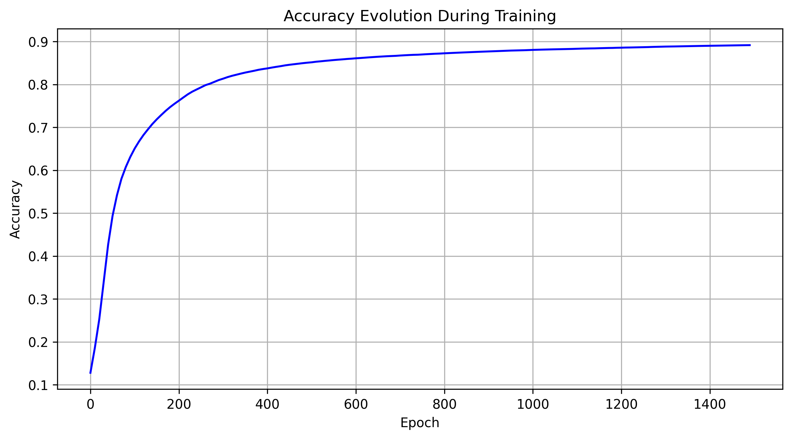
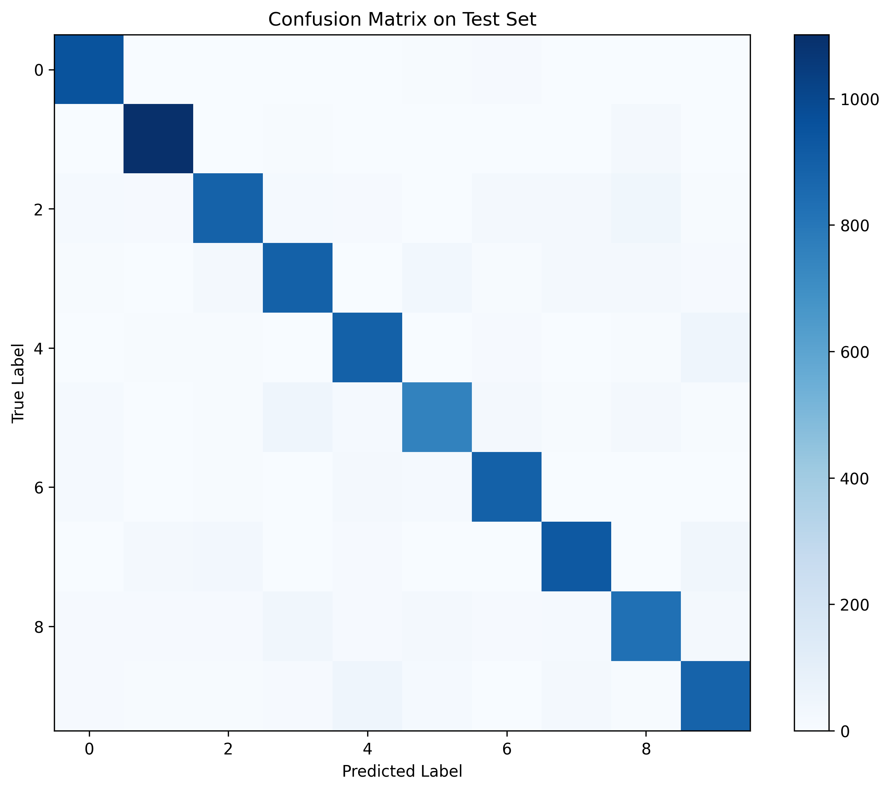

# MNIST Neural Network with NumPy

This project implements a simple fully connected neural network to classify handwritten digits from the MNIST dataset using only NumPy (without TensorFlow/Keras).

## Overview

The MNIST dataset consists of 70,000 grayscale images (28×28 pixels) of handwritten digits (0-9).
This project implements a basic 2-layer neural network with the following structure:

- Input Layer – 784 neurons (28×28 pixels)
- Hidden Layer – 128 neurons (ReLU activation)
- Output Layer – 10 neurons (Softmax activation)
- Training Iterations – 1,250 iterations

## Accuracy

As shown in the figure below, the accuracy with 128 neurons in the hidden layer approaches 90% after 1,000 iterations. Increasing the number of iterations and neurons in the hidden layer can improve accuracy by approximately 3-5%.

For example:

With 200 neurons and 2,000 iterations, the model achieves 91%-93% accuracy.
With 128 neurons and 1,000 iterations, accuracy is around 87%-89%. We have to take into account that the time in computation also increases by quite a lot. 

## Accuracy on the Test Set
The confusion matrix reveals that the model struggles the most with distinguishing the digit 5, significantly more than other numbers. This issue could be mitigated by providing more training examples of the digit 5.

Overall, accuracy across different digits is fairly consistent, with the number 1 having the highest accuracy. The overall average accuracy for the test set is around 90%.

